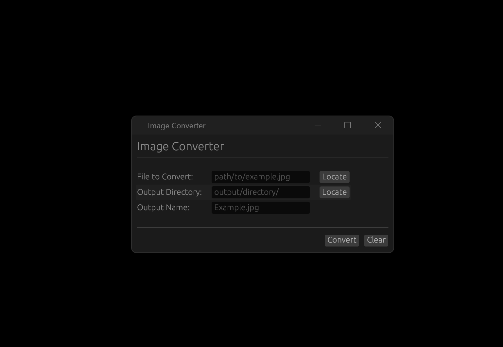
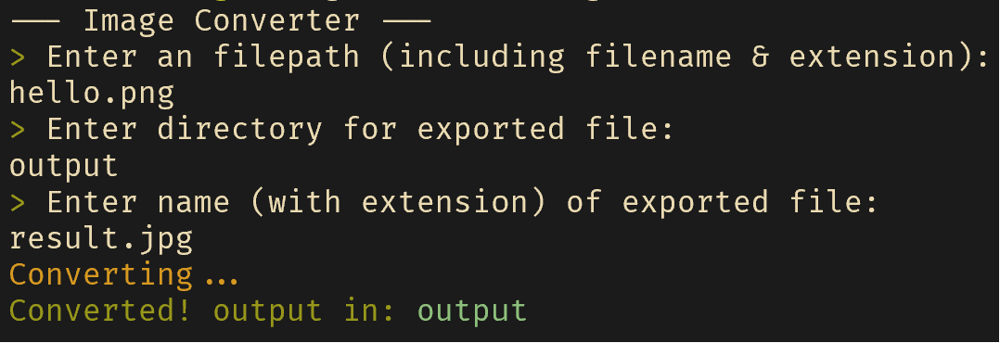

# PixWarp Image Converter
Convert your images easily!

*GUI*

*CLI*


## Status
- CLI: **Working!**
- GUI: **Working!**

## Supported Formats:
- JPG
- PNG
- ICO
- BMP
- GIF
- WEBP
- AVIF
- TIFF

## Installation

Ensure that you have Rust and Cargo installed. You can install them together [here](https://www.rust-lang.org/tools/install).

### CLI
Clone the repository and run:
```rust
cargo build --release --features "headless"
```
### GUI
Clone the repository and run:
```rust
cargo build --release --features "gui"
```

After compiling for both builds is located in `/target/release/`. Feel free to move the exe to a more convenient location. There are no external resources to worry about!

Find the resulting executable in `/target/release`.

## Dependencies
- [image](https://github.com/image-rs/image) - All the actual conversion work
- [colored](https://github.com/colored-rs/colored) - Colored terminal output
- [eframe](https://github.com/emilk/egui/tree/master/crates/eframe) - Window management + more
- [egui](https://github.com/emilk/egui/tree/master) - GUI library
- [rfd](https://github.com/PolyMeilex/rfd) - Cross-platform file dialog

## License
This software does not have its own license. It abides and follows the guidelines of its dependencies.

## TODO
I would like to add `HEIC` support in the future.

## Author
Michael Williams
[Website](https://codingwithsphere.com)